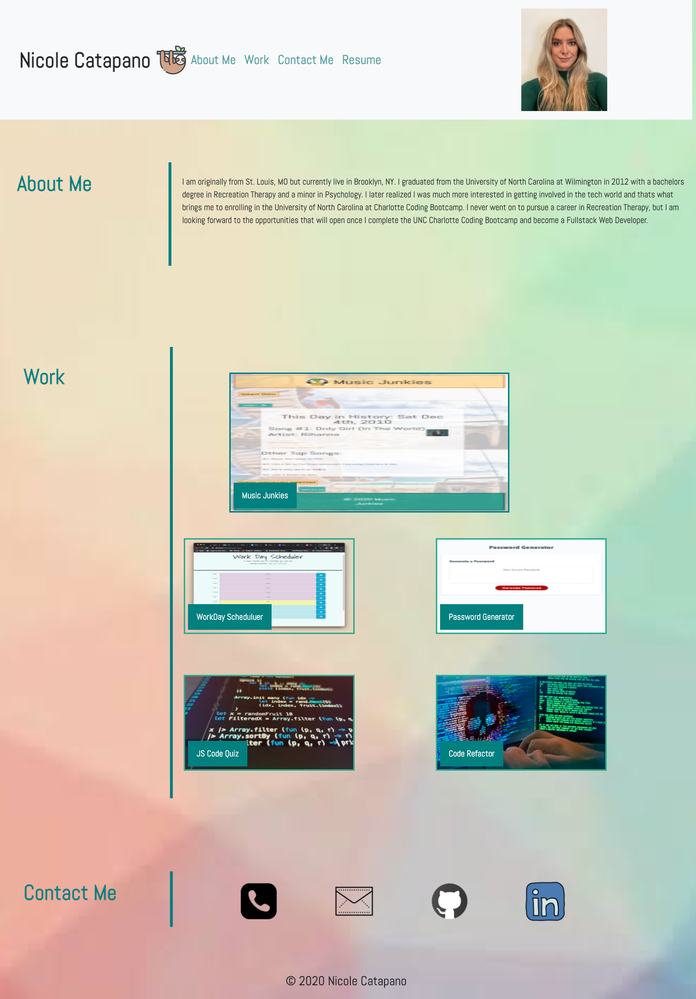

# Responsive-Portfolio

## Description

This is a professional portfolio of the web developer's background information, work, and how she can be contacted if interested for hire. Included is a recent photo of the developer and their name. This is a page that best showcases skills and talents to best highlight her strongest work and thought processes. This page is user friendly and when you click one of the links in the navigation, it scrolls to each corresponding section.

When the user clicks on the link abut their work, it scrolls to the section with titled images of the developers applications, which are linked to their work which will deploy live when clicked. This page has a responsive layout that adapts to different viewport--allowing it to be used on different device layouts/screen sizes.

While some of the photos in the "Work" section do not have links to deploy, they will be added later as more applications are created throughout the semester and well after. Developer provides links to deploy their own websites for contacting them i.e.; when you click on the email it brings up whatever mail provider a user has and a brand new email to fill out. When click on GitLab it deploys their personal account with all repositories, and when clicking LinkedIn it brings up their personal LinkedIn page.

## Tech/Framework Used

VS Code

## Installation

https://nsc9605.github.io/Responsive-Portfolio/

## Demo Screenshot

## License

© 2020 Nicole Catapano 

