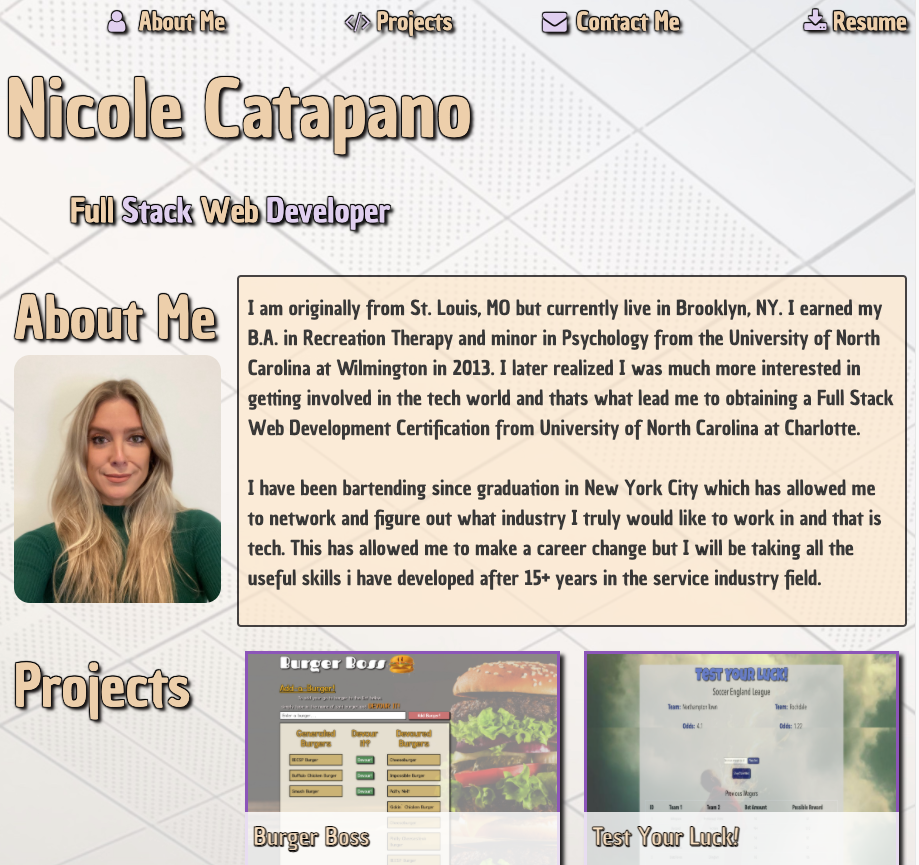
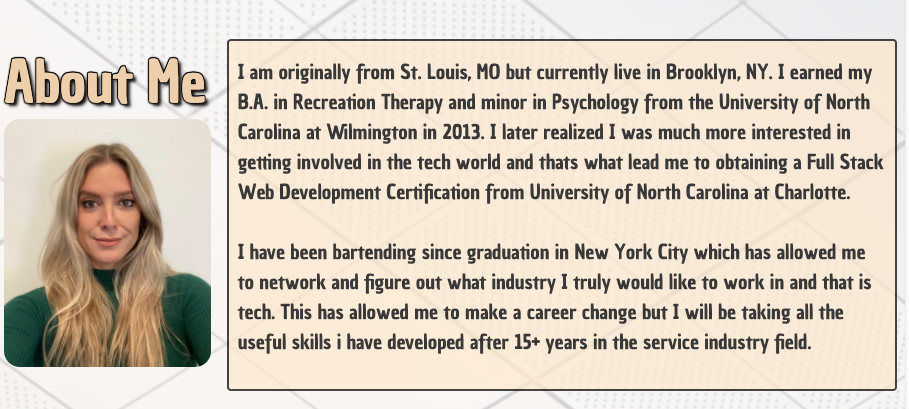
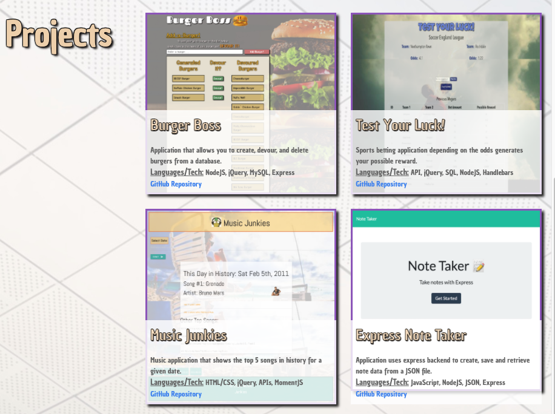
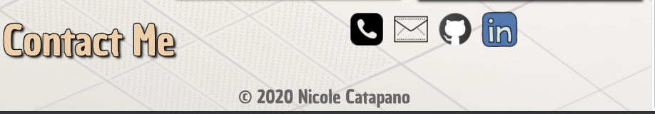

# Responsive-Portfolio

## Description

This is a professional portfolio displaying information about me, projects I have completed with description, deployed link and link to GitHub Repository as well. Included is a recent photograph as well as some background information about me. This page is user friendly and when you click one of the links in the navigation, it scrolls to each corresponding section.

:round_pushpin: [Click here to view deployed page!](https://nsc9605.github.io/Responsive-Portfolio/) :round_pushpin:

## Table of Contents

- [Demonstration](#demonstration)
- [Features](#features)
- [Usage](#usage)
- [License](#license)
- [Contribution](#contribution)
- [Technologies](#technologies)
- [Contact Information](#contact-information)

## Demonstration

### About Me Section

### Projects Section

### Contact Information

## Features

- When the user clicks on the nav-link item it scrolls to the section corresponding to the topic. 
- When `About Me` is selected, it will drop down to a photograph and description about me.
- In the `Projects` section, applications are showcased with titled images, short description, languages/tech used and link to Github repo are provided for each. 
- Links to social bars are provided in the `Contact Me` section at the bottom of the page. When an icon is pressed, it will take you directly to the page such as my `LinkedIn` page, `GitHub` Profile, as well as open a new `email` draft when clicked depending on the users provider, and the `phone` icon is set to call when clicked, or user can hover over the icon and the links/info will be displayed at the bottom of the page.
- When `Resume` is clicked it will provide a downloadable PDF file of my up-to-date resume.
- This page has a responsive layout that adapts to different viewport--allowing it to be used on different device layouts/screen sizes. 

## Usage

[Click here to deploy application!](https://nsc9605.github.io/Responsive-Portfolio/)

## License

This application is licensed under the MIT License.

## Contribution

This project was creating with help from:

- My tutor [Eric Wallen](https://github.com/ericwallen)
- [W3Schools](https://w3schools.com)

## Technologies

- [Visual Studio Code](https://code.visualstudio.com/)
- [UIKit](https://getuikit.com)
- Terminal

## Contact Information

- GitHub: [nsc9605](https://github.com/nsc9605)
- Portfolio: [Deploy Portfolio](https://nsc9605.github.io/Responsive-Portfolio/)
- Email: [Nicole Catapano](mailto:nsc9605@gmail.com)
